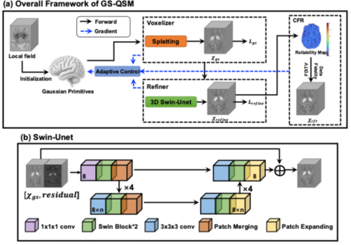

# GSQSM: Unsupervised Gaussian Splatting for Quantitative Susceptibility Mapping

GSQSM is an unsupervised QSM reconstruction method based on physics-guided Gaussian splatting. It represents the susceptibility distribution with learnable 3D Gaussian primitives and optimizes them using the QSM dipole forward model. The pipeline also includes adaptive density control, a lightweight Swin-UNet refiner, and CFR-based denoising.

## Overview and Pipeline

QSM reconstructs tissue magnetic susceptibility from MRI phase-derived local fields. The field-to-source inversion is ill-posed because the dipole kernel contains zero and near-zero regions in k-space. GSQSM addresses this problem by optimizing an explicit Gaussian representation under field-domain consistency instead of directly optimizing a dense voxel-wise susceptibility map.

<p align="center">
  
</p>

<p align="center">
  <em>Figure 1. Overall pipeline of GSQSM.</em>
</p>

Given a preprocessed local field map, GSQSM initializes 3D Gaussian primitives inside the brain region and voxelizes them into a susceptibility map through differentiable splatting. The predicted local field is computed with the QSM dipole forward model and matched to the measured local field. During optimization, adaptive density control updates the Gaussian primitives. The lightweight Swin-UNet refiner predicts residual susceptibility correction, and the CFR module performs reliability-guided denoising to generate the final susceptibility map.

## Results

On the 2019 QSM Challenge simulation data, GSQSM achieved average NRMSE, HFEN, and XSIM values of **47.76%**, **38.46%**, and **75.05%**, respectively, across the four simulation settings listed in Table 1.

<p align="center">
  
</p>

<p align="center">
  <em>Figure 3. Comparison of different QSM reconstruction methods on representative 2019 QSM Challenge simulation settings.</em>
</p>

### Quantitative Results on the 2019 QSM Challenge

Values are reported in the order of **Sim1SNR1 / Sim1SNR2 / Sim2SNR1 / Sim2SNR2**. Best values are highlighted in bold.

| Method | NRMSE (%) ↓ | HFEN (%) ↓ | XSIM (%) ↑ |
|---|---:|---:|---:|
| iLSQR | 77.88 / 64.51 / 57.57 / 51.70 | 49.07 / 43.82 / 47.07 / 44.19 | 50.51 / 62.32 / 60.53 / 66.98 |
| MEDI | 57.14 / 49.01 / 51.66 / 48.89 | **37.58** / **34.20** / 46.04 / 45.42 | 72.99 / 76.59 / 70.62 / 72.57 |
| LPCNN | 55.57 / 51.75 / 47.61 / 46.91 | 47.97 / 46.52 / 47.63 / 46.69 | 61.20 / 66.37 / 66.99 / 68.28 |
| INRQSM | 63.69 / 57.78 / 56.78 / 55.32 | 55.17 / 51.38 / 60.94 / 60.95 | 56.29 / 60.30 / 57.54 / 59.04 |
| MODIP | 65.50 / 55.14 / 55.73 / 51.39 | 47.31 / 45.33 / 50.47 / 49.99 | 57.51 / 67.25 / 62.67 / 66.60 |
| GSQSM | **53.55** / **46.74** / **46.37** / **44.38** | 38.01 / 35.56 / **37.39** / **42.88** | **73.12** / **78.62** / **73.66** / **74.80** |

## Quick Start

### Installation

```bash
git clone https://github.com/Itachi711/GSQSM.git
cd GSQSM

conda create -n gsqsm python=3.10
conda activate gsqsm
pip install -r requirements.txt
```

### Run a Single Case

```bash
python recon.py \
  --phi ./dataset/vivo/CAA/lfs.nii \
  --out ./deepMRI/gsqsm/CAA
```

If a brain mask is available:

```bash
python recon.py \
  --phi ./dataset/vivo/CAA/lfs.nii \
  --mask ./dataset/vivo/CAA/mask.nii \
  --out ./deepMRI/gsqsm/CAA
```

The final reconstruction is saved under the output directory, typically as:

```text
<out>/<run_name>/gsqsm.nii
```

For example:

```text
./deepMRI/gsqsm/CAA/gsqsm/gsqsm.nii
```

## Command-Line Arguments

| Argument | Required | Description |
|---|---:|---|
| `--phi` | Yes | Path to the input local field map in NIfTI format. This should be a preprocessed local field map rather than raw phase. |
| `--mask` | No | Path to the brain mask in NIfTI format. If not provided, the code uses the current internal mask handling strategy. |
| `--out` | Yes | Output directory for reconstructed results and logs. |
| `--config` | No | Path to a configuration file if supported by the current code version. |
| `--device` | No | Computation device, such as `cuda` or `cpu`. |

Example:

```bash
python recon.py \
  --phi ./dataset/vivo/CAA/lfs.nii \
  --mask ./dataset/vivo/CAA/mask.nii \
  --out ./deepMRI/gsqsm/CAA \
  --device cuda
```

In the current command-line interface, `--phi` refers to the local field map used for QSM reconstruction.

## Input and Output

### Input

GSQSM expects a preprocessed local field map as input. The local field should have been processed by phase unwrapping and background field removal before reconstruction. If a mask is provided, it should be aligned with the local field and have the same matrix size and affine information.

### Output

The main output is:

```text
gsqsm.nii
```

This file is the final reconstructed susceptibility map. When the refiner and CFR modules are enabled, it corresponds to the output after the full GSQSM pipeline. When some modules are disabled for ablation, it corresponds to the last enabled reconstruction stage.

## Related Work

GSQSM is related to conventional QSM reconstruction methods such as COSMOS, TKD, iLSQR, MEDI, and STAR-QSM. It is also related to learning-based QSM methods including QSMnet, xQSM, autoQSM, LPCNN, MoDL-QSM, iQSM, and iQSM+. Among unsupervised or subject-specific methods, AdaIN-based resolution-agnostic QSM, MoDIP, and INR-QSM are especially relevant.

The Gaussian representation in GSQSM is motivated by recent progress in 3D Gaussian splatting and its extensions to medical imaging, including X-Gaussian and R2-Gaussian. GSQSM applies this type of explicit representation to QSM reconstruction under the dipole forward model.
